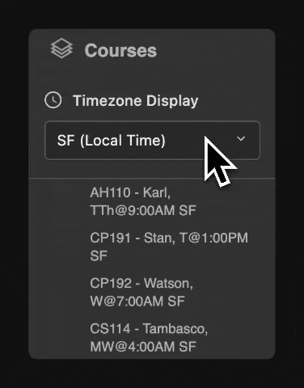

# Minerva Forum Timezone Converter

A Chrome extension that automatically converts class times on [forum.minerva.edu](https://forum.minerva.edu) to your preferred timezone.



## Features

- Converts class times between major Minerva hubs:
  - San Francisco (SF)
  - Buenos Aires (BA)
  - Seoul
  - Taipei
  - Hyderabad
  - Berlin
  - Tokyo
- Automatically detects your local timezone
- Dark theme UI that matches Minerva's forum design
- Remembers your timezone preference
- Shows original time on hover

## Download Instructions

1. Go to the [Releases page](https://github.com/CarlKho-Minerva/25SF-MNRV_Forum-TimeZoneConverter/releases/tag/v1.1.0)
2. Find the latest version (v1.1.0)
3. Click on `25SF-MNRV_Forum-TimeZoneConverter-v1.1.0.zip`
4. The file will download to your Downloads folder

## Installation Steps

1. Find the downloaded ZIP file
   - Open your Downloads folder
   - Look for `25SF-MNRV_Forum-TimeZoneConverter-v1.1.0.zip`

2. Extract the ZIP file
   - Double-click the ZIP file
   - A new folder will appear

3. Install in Chrome
   - Open Chrome browser
   - Type `chrome://extensions` in the address bar
   - Look for "Developer Mode" switch in top-right corner
   - Turn it ON
   - Click "Load unpacked" button
   - Find and select the extracted folder
   - Click "Open"

If something goes wrong:

- Make sure all files are properly extracted
- Check that Developer mode is turned ON
- Try clicking the refresh icon on the extension card
- Make sure you're using Google Chrome (not Firefox or Safari)

## Usage

1. Visit [forum.minerva.edu](https://forum.minerva.edu)
2. Look for the timezone selector below the "Courses" section
3. Choose your preferred timezone
4. All course times will automatically update to your selected timezone
5. Hover over times to see the original timezone information

## Development

The extension uses:

- Moment.js for timezone calculations
- Chrome Storage API for saving preferences
- MutationObserver for handling Minerva's dynamic content

### Project Structure

```
25SF-MNRV_Forum-TimeZoneConverter/
├── manifest.json          # Extension configuration
├── popup/
│   ├── popup.html         # Timezone selector popup UI
│   └── popup.js           # Popup interaction logic
├── content/
│   ├── content.js         # Main timezone conversion logic
│   └── lib/
│       ├── moment.js      # Time handling library
│       └── moment-timezone-with-data.js  # Timezone data
└── background/
    └── background.js      # Background service worker
```

### Supported URL Patterns

- `*://forum.minerva.edu/*`

### Features in Detail

1. **Automatic Local Time Detection**
   - Detects your system timezone on first use
   - Marks your local timezone with "(Local Time)" in the dropdown

2. **Time Conversion**
   - Converts all course times instantly
   - Preserves course codes and instructor names
   - Shows abbreviated city names (SF, BA) for cleaner display

3. **UI Integration**
   - Matches Minerva's dark theme (#343434)
   - Uses system font stack for consistency
   - Responsive dropdown with custom styling

4. **Hover Information**
   - Original time and timezone
   - Converted time and timezone
   - Full timezone path for verification

### Contributing

1. Fork the repository
2. Create a new branch
3. Make your changes
4. Submit a pull request

### License

MIT License

### Contact

For issues or suggestions, please open an issue in the repository.
