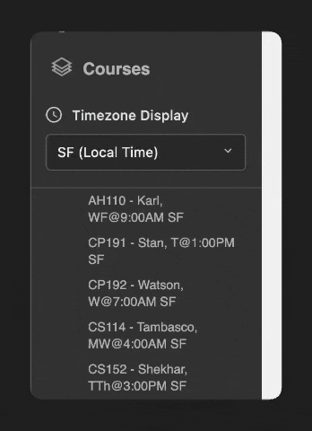

# Minerva Forum Timezone Converter

A Chrome extension that automatically converts class times on forum.minerva.edu to your preferred timezone.

## Features

- Converts class times between major Minerva hubs:
  - San Francisco (SF)
  - Buenos Aires (BA)
  - Seoul
  - Taipei
  - Hyderabad
  - Berlin
  - Tokyo
- Automatically detects your local timezone
- Dark theme UI that matches Minerva's forum design
- Remembers your timezone preference
- Shows original time on hover

## Installation

1. Download or clone this repository
2. Open Chrome and go to `chrome://extensions/`
3. Enable "Developer mode" in the top right
4. Click "Load unpacked"
5. Select the downloaded folder

## Usage

1. Visit [forum.minerva.edu](https://forum.minerva.edu)
2. Look for the timezone selector below the "Courses" section
3. Choose your preferred timezone
4. All course times will automatically update to your selected timezone
5. Hover over times to see the original timezone information

## Development

The extension uses:
- Moment.js for timezone calculations
- Chrome Storage API for saving preferences
- MutationObserver for handling Minerva's dynamic content

### Project Structure
